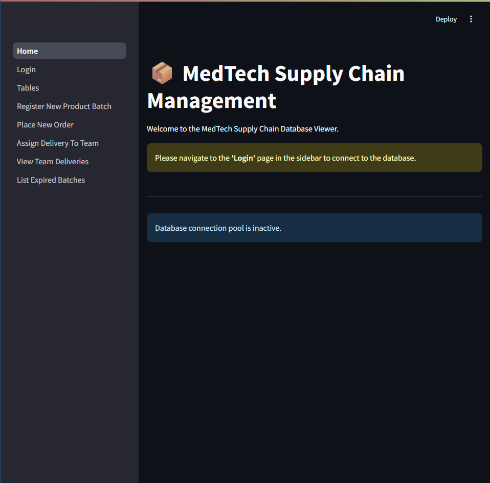
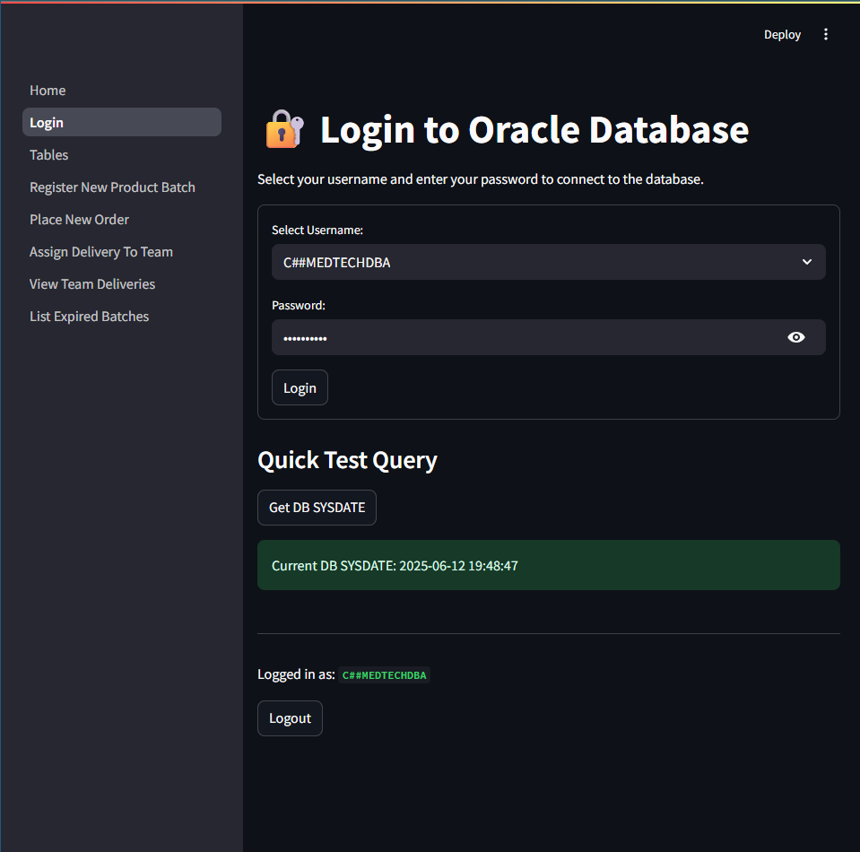
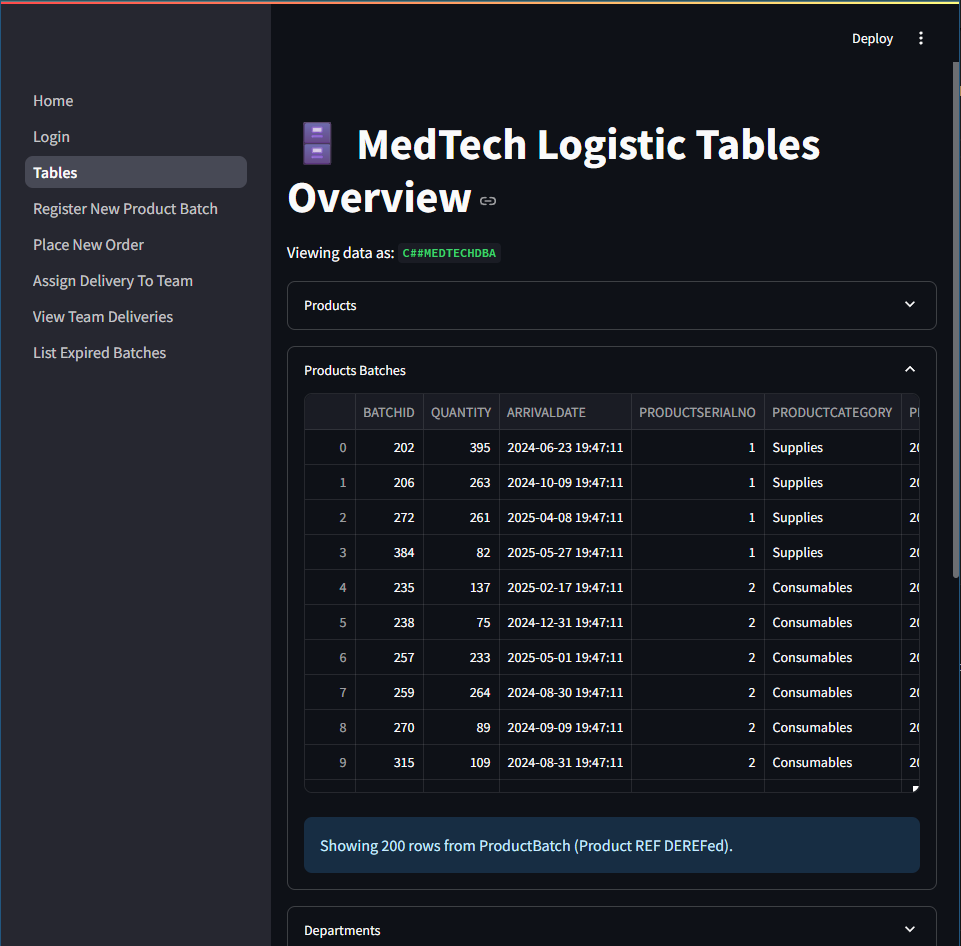

# StageUp Event Setup Exam Project
> Object-relational Oracle 21c project template for database systems exam practice.

[![CC BY-NC 4.0][cc-by-nc-shield]][cc-by-nc]

[cc-by-nc]: https://creativecommons.org/licenses/by-nc/4.0/
[cc-by-nc-image]: https://licensebuttons.net/l/by-nc/4.0/88x31.png
[cc-by-nc-shield]: https://img.shields.io/badge/License-CC%20BY--NC%204.0-lightgrey.svg

## Project Overview

This repository implements an Oracle object-relational event setup system with a Streamlit demo app.

The current implementation is based on these core entities:

- Office_TAB
- Customer_TAB
- Team_TAB
- Location_TAB
- Equipment_TAB
- Booking_TAB

## Getting Started

### Prerequisites

- [Docker](https://www.docker.com/get-started)
- [Python 3.12](https://www.python.org/downloads/)

### Launching the Database with Docker Compose

1. Clone the repository:
    ```bash
  git clone https://github.com/<your-username>/stageup-inc-logistics-exam.git
  cd stageup-inc-logistics-exam
    ```
2. Create your local environment file:
  ```bash
  cp .env.example .env
  ```
3. Start the Oracle 21c database:
    ```bash
    docker-compose up -d
    ```
4. Wait **a few minutes** for the database to initialize.

### Running the Streamlit Demo

1. Install Python dependencies:
    ```bash
    pip install -r webapp/requirements.txt
    ```
2. Launch the Streamlit app:
    ```bash
    streamlit run webapp/Home.py
    ```
3. Open your browser and go to the URL provided by Streamlit.

## Database Bootstrap Order

The Docker container executes scripts in this order:

1. scripts/00_stageupdba.sql
2. scripts/01_types.sql
3. scripts/02_tables.sql
4. scripts/03_indexes.sql
5. scripts/04_triggers.sql
6. scripts/05_views.sql
7. scripts/06_populatedb.sql
8. scripts/07_triggertests.sql

This order is required because triggers and views depend on tables, and tests depend on populated data.

## Implemented Object Types

The schema uses Oracle object-relational features including object types, REF columns, VARRAY collections, and views built with DEREF.

Main custom types:

- Address_t
- Member_t
- Member_VA
- Team_t
- Office_t
- Customer_t
- Location_t
- Booking_t

## Implemented Tables

- Office_TAB
- Customer_TAB
- Team_TAB
- Location_TAB
- Equipment_TAB
- Booking_TAB

## Implemented Indexes

Indexes are defined in scripts/03_indexes.sql for:

- REF navigation fields in Booking_TAB and Location_TAB
- Team performance sorting
- Booking categorical filtering
- Office type filtering

## Implemented Triggers

Triggers are defined in [scripts/04_triggers.sql](scripts/04_triggers.sql) and include:

- `TrgSyncTeamOps`: synchronizes team installation counters when a booking is inserted, deleted, or reassigned
- `CHECK_TEAM_CONSTRAINTS`: enforces zero initial operations and incremental updates on `N_Total_Installations`
- `TrgTeamMemberDates`: rejects future or missing birth dates for team members
- `TrgBookingDates`: rejects bookings dated in the past
- `TrgTeamMustHaveMembers`: prevents empty team member collections

The following constraints are enforced at table level in [scripts/02_tables.sql](scripts/02_tables.sql):

- booking type domain and positive booking cost
- customer email format
- positive location setup time and equipment capacity

See scripts/01_types.sql through scripts/07_triggertests.sql for full DDL, data population, and validation tests.

## Streamlit Demo Home Page

Below is a screenshot of the Streamlit demo application's home page:



## Login Page

To access the demo application, use credentials defined in your `.env` file:

- `SYS_DB_USER` / `SYS_DB_PASSWORD` for the user list lookup
- Schema user password (for example `STAGEUPDBA_PWD`) for app login

> **Tip:** If the current date from the database is displayed correctly in the demo app, your connection to the Oracle 21c database is working as expected.



## Tables Overview

The following screenshot displays all database tables as shown in the demo application after automatic population by Docker:



> If some tables appear empty, it means you logged in before the population process was completed. Please close the streamlit demo and do the whole procedure by the start.

## Streamlit Pages

The application exposes the following pages in webapp/pages:

- 1_Login.py: user login and connection test
- 2_Tables.py: raw tables and view previews
- Op1_Register_New_Customer.py: operation 1 customer onboarding workflow
- Op2_Record_New_Booking.py: operation 2 booking creation workflow
- Op3_Register_Event_Location.py: operation 3 location registration workflow
- Op4_View_Team_at_Location.py: operation 4 team-by-location analysis
- Op5_Location_Activity_Report.py: operation 5 location activity analytics
- Op6_Manager_Dashboard.py: manager dashboard with KPIs, trends, and scoreboards

## Notes

- The data population script generates realistic synthetic data for demo/testing.
- Trigger tests intentionally include expected failures to validate constraints.
- Equipment stock updates are currently manual because no direct Booking-to-Equipment relation is modeled.

## License

This work is licensed under the [Creative Commons Attribution-NonCommercial 4.0 International License][cc-by-nc].

For a copy of the license, please visit https://creativecommons.org/licenses/by-nc/4.0/

[![CC BY-NC 4.0][cc-by-nc-image]][cc-by-nc]
